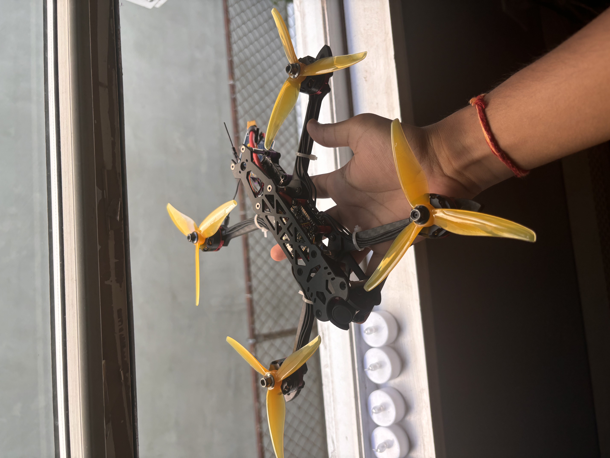
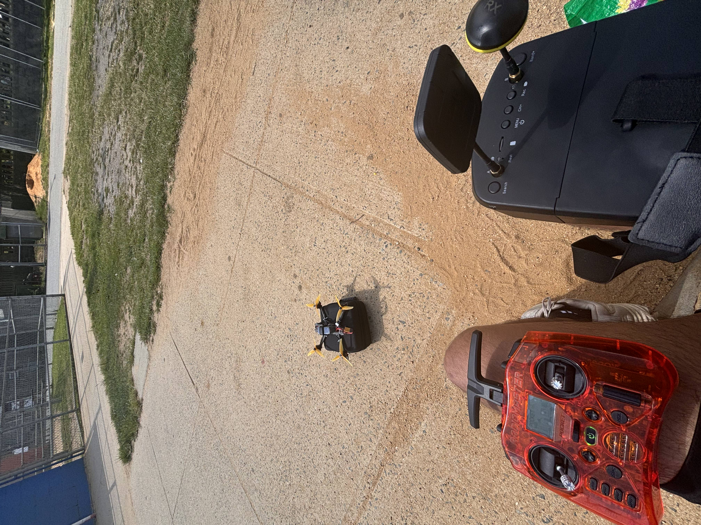
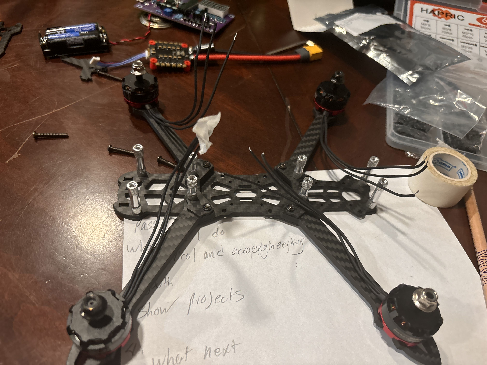
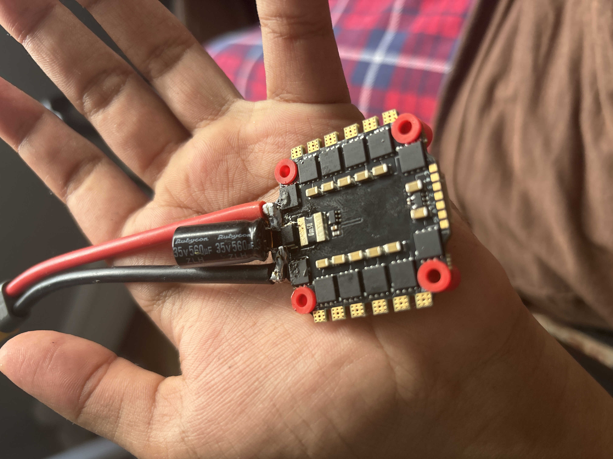
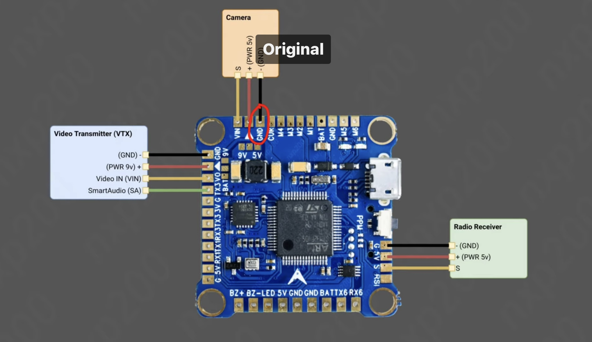
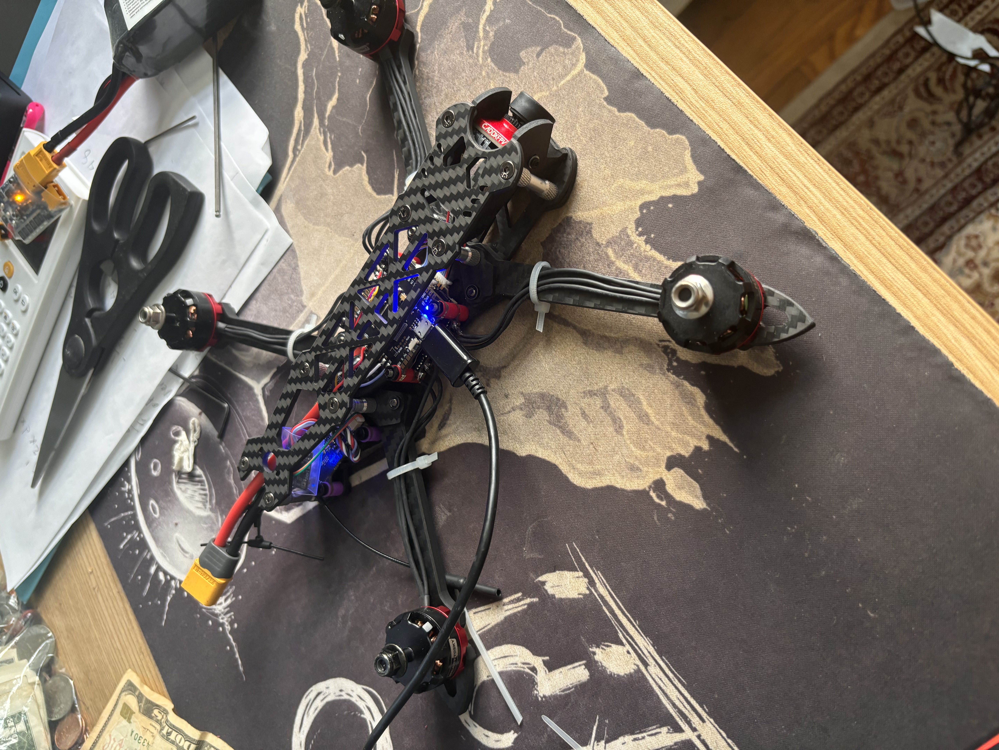
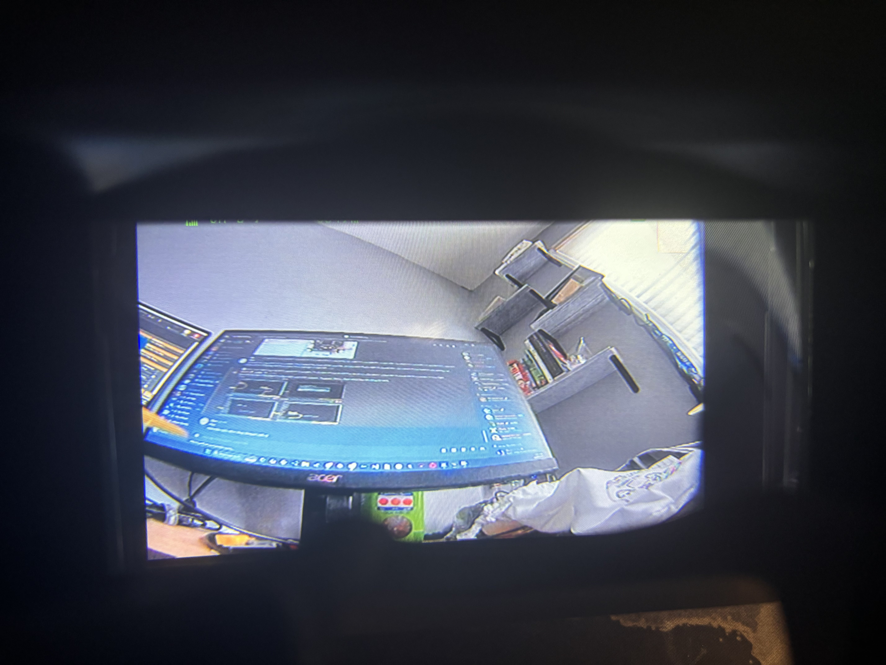
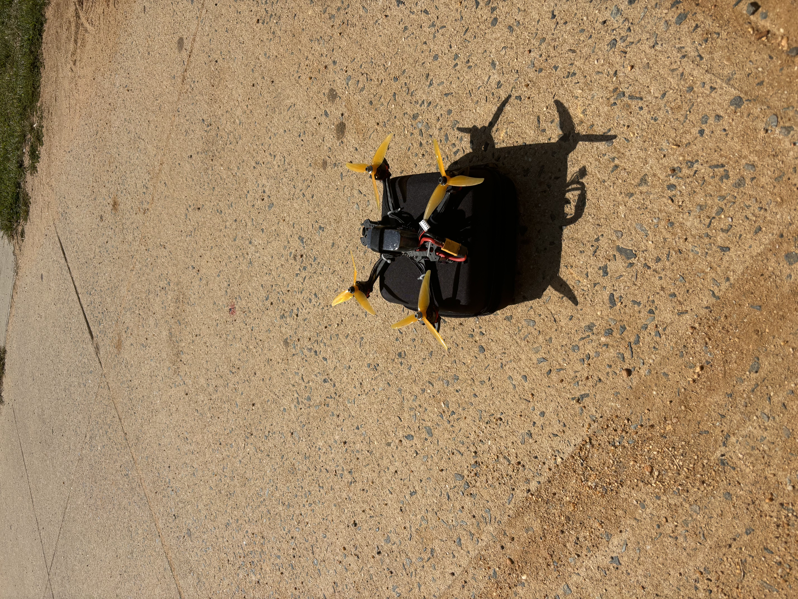

# FPV Drone

5" Analog FPV Drone

Music Video and First Flight: https://drive.google.com/file/d/1u81eMg4rBYhqM3jJ49E8gZRlQipSc7sH/view?usp=sharing

(Apologies for the poor VTX quality, the propellers chopped the antenna in half)

## Highlights
- 5 Inch Propellers
- 200 meter range
- $100 drone budget
- 60 mph top speed

## Why I made it!!!
During the summer of 2025 I received a generous grant of $250 to innovate in engineering. I had previously worked in the field of embedded systems to create a modular forest fire detection system of nodes. While developing this project I noticed its potential implementation on manned UAVs. With this grant I decided to attempt breaking into the UAV industry by assembling my own custom FPV drone. In addition to the engineering, I spent over 30 hours learning to professionally fly FPV drones and have since discovered a new hobby.  

## Videos

## Basic Overview - Parts
To keep the build under the $120 budget while maintaining freestyle performance, I carefully sourced the following components:
- **Frame:** 5" Carbon Fiber Freestyle Frame 
- **Flight Controller & ESC (Stack):** F405 Flight Controller paired with a 40A-50A 4-in-1 ESC 
- **Motors:** 2207 or 2306 Brushless Motors
- **Video Transmitter (VTX):** 5.8GHz Analog VTX
- **FPV Camera:** 1200TVL Analog Micro Camera
- **Receiver (RX):** ExpressLRS (ELRS) 2.4GHz Nano Receiver
- **Propellers:** 5.1" 3-blade props

## Basic Progression
Assembled frame and motors

Looked over ESC Spec sheet and soldered Capacitor and power cable. 

Soldered Motor wires to ESC and attached Flight Controller to form the stack. Had to review spec sheet for off brand Flight Controller to solder VTX, Camera, and Receiver. 

Assembled entire drone into finished product and flashed betaflight firmware

View of FPV goggles

Set up outdoors before first flight

## Basic Overview - Betaflight Firmware
The drone's software relies on Betaflight to manage flight dynamics and hardware communication. The setup process included:
1. **Flashing & Ports:** Flashed the latest firmware target to the Flight Controller and configured the UART ports for the ELRS receiver and VTX SmartAudio.
2. **Receiver Configuration:** Set the receiver protocol to CRSF to communicate seamlessly with the ExpressLRS system.
3. **Modes Setup:** Programmed the radio transmitter switches for Arming, Flight Modes (Acro/Angle), and Turtle Mode (Flip Over After Crash).
4. **OSD (On-Screen Display):** Customized the analog video overlay to display critical real-time telemetry, including battery voltage, link quality, and flight time.

# Credits
- Written with [StackEdit](https://stackedit.io/).
